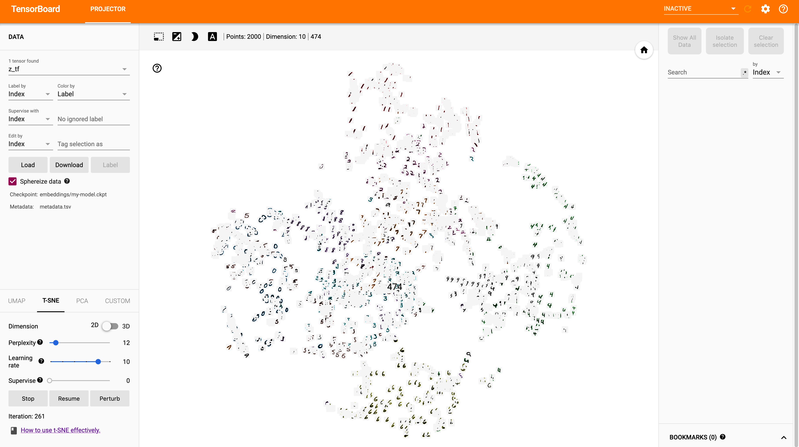
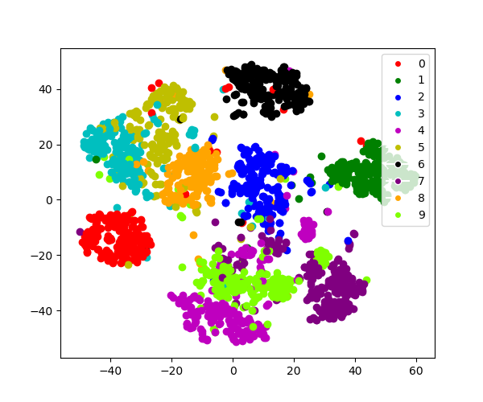

# tSNE-helper

## Motivation
This project aims to make using [Tensorboard's embedding visualization tool](https://www.tensorflow.org/tensorboard/tensorboard_projector_plugin), 
as well as [t-SNE plot using scikit learn](https://scikit-learn.org/stable/modules/generated/sklearn.manifold.TSNE.html),
a bit more easily for machine learning projects. I personally found that the documentation, especially for Tensorboard's
visualzation tool, and had to spend more time actually figuring out *how* to use the tools, rather than actually using the tool.
I hope this project will enable many people to cut some time on visualizing embeddings. 


## Requirement
These are the versions of main libraries that I used for this project.
I believe other versions may work, but Tensorflow and Tensorboard versions should at least be 2.x.x.
```bash
tensorflow 2.1.0
tensorboard 2.1.1
scikit-learn 0.22.1
matplotlib 3.1.3
Pillow 7.0.0
```

## How to use
1. Import the class
    - ```from EmbeddingHelper import EmbeddingHelper```
2. Create an instance of the class
    - ```embedding_helper = EmbeddingHelper(encoder=encoder, data_generator=generator, embeddings_dir=embedding_dir)```
        - *encoder* is a model that when *predict* is called, outputs tensor shape (batch_size, embedding_dim).
        - *data_generator* is a generator that yields the original data and the corresponding label as a tuple: (x, y).
        - *embeddings_dir* is the directory where all the files related to the embeddings will be logged.
    - The instantiating of class may take a while, as it generates the embeddings and metadata during the init.
    
3. (Optional) Create sprites of the data
    - If the data can be made into sprites, you can also call ```embedding_helper.create_sprite()``` to create sprites for Tensorboard.
        - Additionally, if you need to preprocess the data in a custom way, edit *_preproces_data()* function in the class.
    - If there are no sprites created, the points on Tensorboard will simply be circles.
        
4. Project the embeddings onto Tensorboard
    - Call ```embedding_helper.to_tensorboard()``` to project all the data onto Tensorboard.
    - To view the embeddings, go to the directory *one above* the specified <embedding_dir>. Then, use the following bash command.
    ```tensorboard --logdir <embedding_dir>```
        - Tip: Use *Spherize Data* before using t-SNE plot on Tensorboard.
     - Additioanlly, you can use Tensorboard to do more than tSNE plots. For example, you can also do PCA visualization.

5. Create t-SNE plot
    - Call ```embedding_helper.tsne_plot(labels=label_list, colors=colors, filename='tsne.png', show=False)``` to create t-SNE plot.
    - *labels* takes in list of all the unique labels. Each element should be a string. For example, fo MNIST, it would be ['0', '1', '2', '3', '4', '5', '6', '7', '8', '9'].
    - *colors* takes in list of color to be used for each point's label. The length needs to be same as the length of *labels*.
    - *filename* is a string that specifies the filename of the plot.
        - The plot will be saved to <embedding_dir>/filename
    - *show* set to True will call ```plt.show()```
    - The function also takes in exact same arguments as sci-kit learn's tSNE function to allow for customization.
    
    
## Example Code
[main.py](https://github.com/chaddy1004/tSNE-helper/blob/master/main.py) shows an example on how this library is used.
Simply clone the repository, and call
```bash
python main.py
```
This example use Variational AutoEncoder created for MNIST dataset. 

### Result
#### Tensorboard screenshot


As seen, the points have corresponding sprites as the markers (this can be turned off in Tensorboard).
#### tSNE plot

